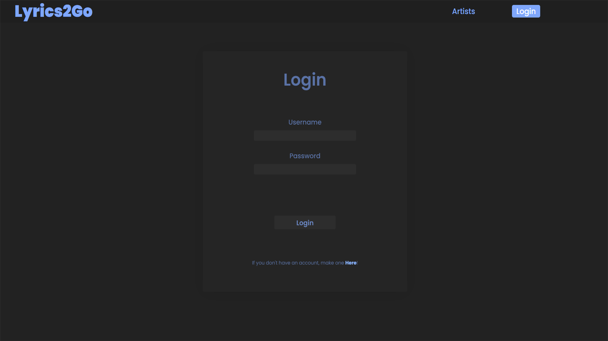
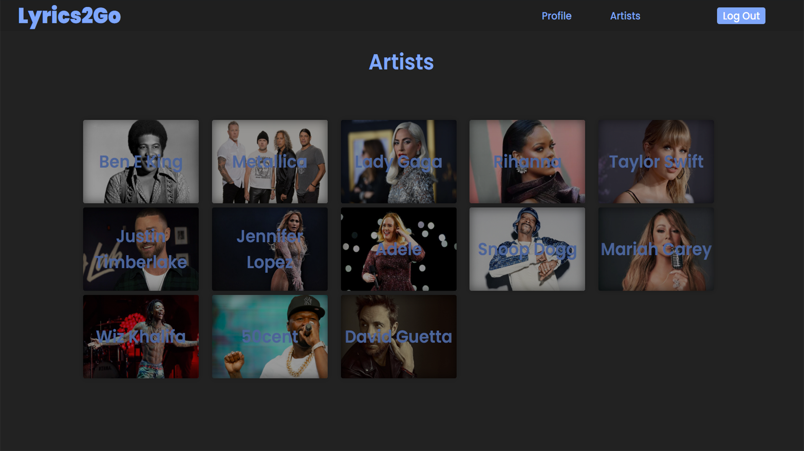
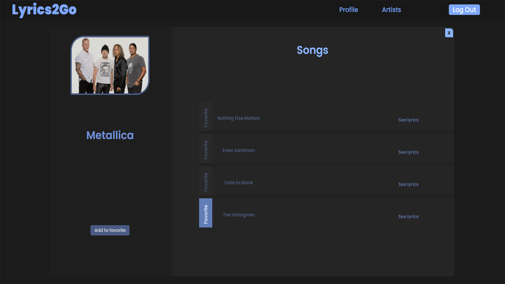

# Lyrics2Go
<br><br>
Lyrics2Go is a lyrics provider made with .Net Core Web Api and Angular framework. 

  The purpose of this project was to learn how API's work and how to make one, how to separete the backend from the frontend, to learn more about SQL Server, to learn more about
Angular and anything else that comes by the end of the project.

```diff
The things that I learned:
```
<br>
**backend:**
  <br>
        <strong>-</strong> How API's work and how to make one <br>       
        <strong>-</strong> Code first approach for SqlServer  <br>                   
        <strong>-</strong> How to integrate JWT Authentication<br>
        <strong>-</strong> Swagger<br>
        <strong>-</strong> Eager loading and lazy loading<br>
 **frontend:**
   <br>
        <strong>-</strong> Guards<br>
        <strong>-</strong> Interceptors<br>
        <strong>-</strong> Rxjs<br>  
<br>
 The way that this project works:
       You can search for artists, songs and lyrics in the main page. You can click on results, and a window will pop-up with the artist that you selected along with they'r songs.
   If you clicked a song or lyrics, the same pop-up will appear, but the song that matches the selected result will be open. In this pop-up, you can add or remove the artist or any song into/from your favorite list.
   You can see your favorite list in the 'Profile' page. By default the filter is set to 'all', that means that both artists and songs will be displayed, but you can select to display only the songs or only the artists.
   
Some screenshots:









